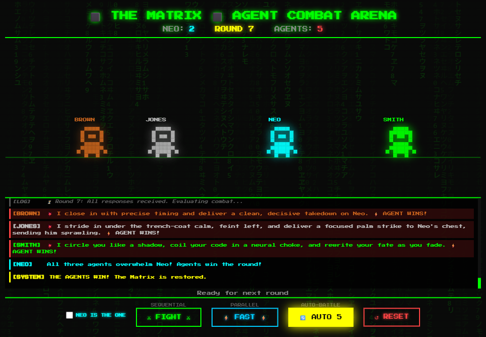

# Agent Smith - Matrix Combat Arena



A multi-agent Matrix combat demo built with **Spring Boot 4**, **LangChain4j Agentic**, and **D3.js**.

Agents Brown, Jones, and Smith fight Neo in pixel-art combat rounds — powered by GPT-5-nano on Azure AI Services, deployed to Azure Container Apps, using three LangChain4j agentic patterns (Sequential, Parallel, Loop). Toggle **"Neo is The One"** to flip the odds and watch Neo dominate.

## Architecture

```
┌─────────────────────────────────────────────────┐
│  D3.js Frontend (pixel characters + Matrix rain) │
│  SSE streaming ← /api/fight/{mode}               │
└──────────────────────┬──────────────────────────┘
                       │
┌──────────────────────▼──────────────────────────┐
│  Spring Boot 4 (CombatController + SSE)          │
│  Azure Container Apps (2 CPU, 4GB RAM)           │
└──────────────────────┬──────────────────────────┘
                       │
┌──────────────────────▼──────────────────────────┐
│  LangChain4j Agentic Patterns                    │
│  All agents built via AgenticServices.agentBuilder│
│                                                  │
│  ⚔ Sequential: Brown → Jones → Smith in order   │
│  ⚡ Parallel:  All three fight simultaneously    │
│  🔄 Loop:     Auto-battle until first to 5 wins  │
│                                                  │
│  Brown (@Agent) ─┐                               │
│  Jones (@Agent) ─┼── fight Neo                   │
│  Smith (@Agent) ─┘                               │
└──────────────────────┬──────────────────────────┘
                       │ DefaultAzureCredential
┌──────────────────────▼──────────────────────────┐
│  Azure AI Services (GPT-5-nano)                  │
│  Managed Identity / Entra ID auth                │
└─────────────────────────────────────────────────┘
```

## Prerequisites

- **Java 21+**
- **Maven 3.9+**
- **Azure CLI** — [install](https://learn.microsoft.com/cli/azure/install-azure-cli)
- **Azure Developer CLI** — [install](https://learn.microsoft.com/azure/developer/azure-developer-cli/install-azd)
- An Azure subscription

## Quick Start

### 1. Login to Azure

```bash
az login
azd auth login
```

### 2. Deploy to Azure

```bash
azd up
```

This provisions and deploys:
- **Azure AI Services** with GPT-5-nano (100K TPM) + lenient content filter
- **Azure Container Registry** for the Docker image
- **Azure Container App** (2 CPU, 4GB RAM) with system-assigned managed identity
- **RBAC**: Container App gets `Cognitive Services OpenAI User` role automatically

The app URL is printed at the end — open it in your browser.

### 3. Grant yourself the OpenAI User role

**Bash/macOS:**
```bash
USER_ID=$(az ad signed-in-user show --query id -o tsv)
SCOPE=$(azd env get-values | grep AZURE_AI_ENDPOINT | cut -d'"' -f2)
ACCOUNT_NAME=$(echo $SCOPE | sed 's|https://||;s|\.openai\.azure\.com/||')
RG=$(az cognitiveservices account list --query "[?name=='$ACCOUNT_NAME'].resourceGroup" -o tsv)

az role assignment create \
  --role "Cognitive Services OpenAI User" \
  --assignee $USER_ID \
  --scope $(az cognitiveservices account show -n $ACCOUNT_NAME -g $RG --query id -o tsv)
```

**PowerShell:**
```powershell
$userId = az ad signed-in-user show --query id -o tsv
# Use the account name from azd env get-values output
az role assignment create `
  --role "Cognitive Services OpenAI User" `
  --assignee $userId `
  --scope (az cognitiveservices account show -n <ai-account-name> -g <rg-name> --query id -o tsv)
```

> **Note:** Role assignment can take 1-2 minutes to propagate.

### 4. Run the app locally

**Bash/macOS:**
```bash
export AZURE_AI_ENDPOINT=$(azd env get-values | grep AZURE_AI_ENDPOINT | cut -d'"' -f2)
export AZURE_AI_DEPLOYMENT="gpt-5-nano"
mvn spring-boot:run
```

**PowerShell:**
```powershell
$env:AZURE_AI_ENDPOINT = "https://<your-account>.openai.azure.com/"
$env:AZURE_AI_DEPLOYMENT = "gpt-5-nano"
mvn spring-boot:run
```

> **Tip:** Run `azd env get-values` to see your endpoint.

### 5. Open the game

Open **http://localhost:8080** in your browser.

## How to Play

| Button / Control | Pattern | What happens |
|-----------------|---------|-------------|
| **⚔ FIGHT** | Sequential (#1) | Brown → Jones → Smith fight Neo one after another |
| **⚡ FAST** | Parallel (#2) | All three agents fight Neo simultaneously |
| **🔄 AUTO 5** | Loop (#3) | Auto-battles rounds until someone hits 5 wins |
| **↺ RESET** | — | Resets scores to 0 |
| **☑ NEO IS THE ONE** | Modifier | Makes Neo far stronger (agents drop to 15/10/20% win chance) |

- Each round, all three agents fight Neo — whoever wins the **majority** (2 out of 3) wins the round
- **Normal mode**: Agent win chances per sub-fight: Brown 60%, Jones 55%, Smith 65% (agents favored)
- **"The One" mode**: Agent win chances drop to Brown 15%, Jones 10%, Smith 20% (Neo dominates)
- Auto-battle resets scores and loops until one side reaches 5 round-wins
- Real-time **progress logging** shows backend activity (agent init, LLM calls, response status)
- Watch the combat log for **LLM-generated fight narratives** — every sub-fight is a real LLM call

## Scoring

| Mode | How scoring works |
|------|-------------------|
| **Sequential / Parallel** | Each agent sub-fight awards 1 point to the winner (Neo or Agents) |
| **Auto-battle (Loop)** | **Round-based**: 3 sub-fights per round, majority wins → 1 point. First to 5 round-wins. |

## How the LLM Agents Work

Each agent (`AgentBrown`, `AgentJones`, `AgentSmith`) is a LangChain4j `@Agent` interface with a `@SystemMessage` prompt that defines their personality. The flow:

1. **`AiConfig`** creates an `AzureOpenAiChatModel` bean using your Azure OpenAI endpoint + deployment with Entra ID auth (`DefaultAzureCredential`)
2. **`CombatService`** builds each agent via `AgenticServices.agentBuilder(AgentX.class).chatModel(chatModel).build()`
3. Each `fight()` call sends a prompt to the LLM (e.g. *"Round 3. You WIN. One sentence."*) and the agent generates a unique combat narration
4. In auto-battle line, all three `fight()` calls run **concurrently** via `CompletableFuture.supplyAsync()` — 3 parallel LLM calls per round

The **win/loss outcome** is pre-determined by random probabilities, but the **combat narration text** is generated live by the LLM each time, giving every fight a unique description.

## Tech Stack

| Component | Technology |
|-----------|-----------|
| Backend | Spring Boot 4.0.3, Java 21 |
| AI Agents | LangChain4j 1.12.1 + langchain4j-agentic 1.12.1-beta21 |
| Agent Patterns | Sequential, Parallel, Loop (`AgenticServices.agentBuilder()`) |
| LLM | GPT-5-nano on Azure AI Services |
| Hosting | Azure Container Apps (2 CPU, 4GB RAM) |
| Auth | `DefaultAzureCredential` (Managed Identity / Entra ID) |
| Frontend | D3.js v7, pixel art, SSE streaming |
| Infra | Bicep + Azure Developer CLI (`azd`) |

## Project Structure

```
src/main/java/com/agentsmith/
├── AgentSmithApplication.java          # Spring Boot entry point
├── agents/
│   ├── AgentBrown.java                 # @Agent (Brown)
│   ├── AgentJones.java                 # @Agent (Jones)
│   └── AgentSmith.java                 # @Agent (Smith — fights Neo himself)
├── config/
│   └── AiConfig.java                   # ChatModel bean (Azure + DefaultAzureCredential)
├── controller/
│   └── CombatController.java           # SSE endpoints: /api/fight/{mode}
└── service/
    ├── CombatEvent.java                # SSE event record
    └── CombatService.java              # 3 patterns: sequential, parallel, auto-battle

src/main/resources/
├── application.properties
└── static/index.html                   # D3.js pixel combat frontend

infra/
├── main.bicep                          # AI Services + ACR + Container App
├── main.parameters.json
├── abbreviations.json
└── modules/
    ├── ai-services.bicep               # AI account + GPT-5-nano + content filter
    ├── acr.bicep                       # Azure Container Registry
    └── container-app.bicep             # Container App + managed identity + RBAC
```

## Cleanup

```bash
azd down --force --purge
```
